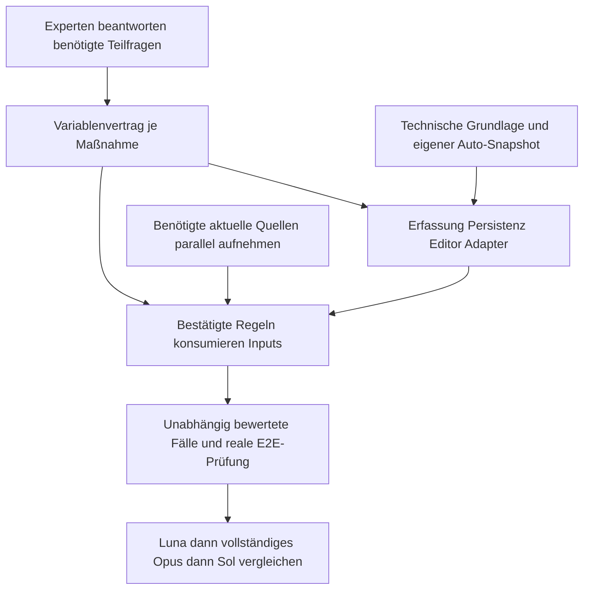

# Gemeinsame Erfassung und Umsetzung nach Teilantworten

Planungsstand, keine App-Implementierung. Jede kleine PR benötigt passende Tests/CI und kurze reasons. Die bestehende Agenda-PR bleibt Draft; Merge und fachliche Aufnahme sind gesonderte Schritte.

## Synergien

Gemeinsame Belege und Erfassung können wiederverwendet werden. Die Auswertung bleibt maßnahmenbezogen; gleiche Bezeichner rechtfertigen keine String-Aliase.

### S01: Ein aktueller Fakten- und Belegkontext für alle Teilprüfungen

Ausgewählter Snapshot, vertrauenswürdiger aktueller Stichtag/Jahr, je Wert Eingabeherkunft und Dokumentation, Ereignis-/Melde-/Ausstellungs-/Gültigkeitsdatum, Quellenfassung und benannter Vollständigkeitsscope.

Geltungsbereich: Gemeinsamer Kontext für 26 Maßnahmen; keine Behauptung, dass alle Maßnahmen dieselben Einzelbelege benötigen.

Getrennt bleibt:

- Gestern datiertes unterjähriges RGVE-Mittel ist nicht automatisch ein abgeschlossenes Jahresmittel.
- Wirksames Altprojekt oder historischer Vorrat wird nicht allein wegen des Vorjahres ungültig.
- Zukunftsoptionen, insbesondere UBB-Bio 2027, nur als begründete Notiz.

### S02: Stabile Flächenbeziehungen einmal erfassen, Mengen getrennt berechnen

Betrieb/Teilbetrieb, Feldstück, Schlag, Teilfläche, Agroforst-/Landschaftselement mit stabiler Identität und Beziehungen; datierte Geometrie, Kultur-/MFA-Codehistorie und sichtbare Anlegeherkunft.

Geltungsbereich: Betroffene Maßnahmen: o6_1a, o6_1b, o6_1c, o6_2, o6_3, o6_4, o6_6, o6_7, o6_8, o6_9, o6_10, o6_11, o6_12, o6_13, o6_14, o6_16, o6_17, o6_18, o6_19, o6_23, o6_24. Konkrete Einzelpflichten bleiben maßnahmenbezogen.

Getrennt bleibt:

- AFS zählt zum lokalen Feldstückminimum, nicht zum betrieblichen 7%-DIV-Zähler; der Nenner bleibt eigene Frage.
- BAW: Pfadanteil am tatsächlichen BAW-Schlag versus 4×-Prämienkappe, kein globaler Feldstückanteil.
- NPA 4%-Prämienkappe ist nicht 50%-Pflegefläche; AG 20%-Prämienkappe ist nicht ganzbetriebliche Zugangssperre.
- N 2-DIVSZ, NAT/EBW-DIV und UBB/BIO-Zuschlag verlangen verschiedene Code-/Pflichtscopes.
- App #133: Größte Betriebs-KG oder KG-Liste belegt keine individuelle GIS-Teilfläche.

### S03: Tier-, Gruppen- und Aufenthaltsbelege statt allgemeiner GVE-Proxies

Stabile Tier-/Kohorten-/Gruppen-/Box-/Weide-/Almidentitäten, Kategorien, belegte Bestandsbasis, Herkunft und Zeitbezug; reale Aufenthalte, Registerbewegungen und Meldungen.

Geltungsbereich: Betroffene Maßnahmen: o6_1a, o6_1b, o6_2, o6_3, o6_5, o6_9, o6_14, o6_15, o6_16, o6_18, o6_19, o6_20, o6_21, o6_22. Konkrete Einzelpflichten bleiben maßnahmenbezogen.

Getrennt bleibt:

- Dokumentierte Aggregate bleiben zulässig. Sie ersetzen eine individuelle Historie nur dort nicht, wo die konkrete Pflicht tatsächlich einen Einzeltiernachweis verlangt.
- Heuwirtschaft heute/Erstjahr, Rinder 21 Kalenderjahr, Weide 20 214-Tage-Fenster und Alm 14/15-Aufenthalt bleiben getrennt.
- Schweine 22: Gruppen und Tierliste sind möglich; keine erfundene pauschale Ohrmarkenpflicht.
- NAT WA 01/03 Jahres-RGVE, NW 05 gleichzeitige GVE und NW 06 Jahres-GVE nicht gleichsetzen.
- EBW-Schutzguttier/Indikator ist kein Nutztierbestandsalias.

### S04: Produkte, Chargen, Rationen und Stoffflüsse gemeinsam dokumentieren

Produkt-/Wirkstoff-/Organismusidentität, versionierte Zulassung, Materialrolle und Herkunft, Charge/Lager/Rezept, Mengen mit Einheit, tatsächliche Anwendung auf Fläche/Gruppe und Nachweis.

Geltungsbereich: Betroffene Maßnahmen: o6_1a, o6_1b, o6_1c, o6_2, o6_3, o6_4, o6_6, o6_7, o6_8, o6_9, o6_10, o6_11, o6_12, o6_13, o6_14, o6_16, o6_17, o6_18, o6_19, o6_20, o6_21, o6_22, o6_23, o6_24. Konkrete Einzelpflichten bleiben maßnahmenbezogen.

Getrennt bleibt:

- NPA jegliche Düngung versus o6_2 eigener Tierhaltungs-N versus WRRL jahreswirksame Ausbringung.
- Herbizidverzicht 11 hat keine allgemeine BIO-Ausnahme; AFS-Verbissschutz nicht NPA-BIO-Ausnahme.
- o6_9/16 Schweinerationen bei 88% TM versus o6_22 GVO-/Europa-Herkunft aller Tierarten/Volljahr einschließlich Altvorräten.
- Kompost 21/22 umfasst sämtlichen Festmist aller Tierarten; alternative Methoden nicht pauschal auf zwei Wendungen reduzieren.
- Kauf/Lagerung ist keine Anwendung; 32-/50-kg-Quellenkonflikt bleibt offen.

### S05: Ein Bewirtschaftungsjournal, getrennte Fristen und Wirkungsflächen

Typisierter datierter tatsächlicher Vorgang mit Fläche/Teilfläche, Kulturkette, Menge und Beleg; Aussaat, Pflege, Mahd, Abtransport, Walzen, Striegeln, Umbruch, Ernte und Aufzeichnungsdatum getrennt.

Geltungsbereich: Betroffene Maßnahmen: o6_1a, o6_1b, o6_1c, o6_2, o6_3, o6_4, o6_6, o6_7, o6_8, o6_9, o6_10, o6_11, o6_12, o6_13, o6_14, o6_16, o6_17, o6_18, o6_19, o6_20, o6_21, o6_22, o6_23, o6_24. Konkrete Einzelpflichten bleiben maßnahmenbezogen.

Getrennt bleibt:

- DIVNFZ beginnt nach Bewirtschaftungsabschluss; seit 2025 entfallene gesetzliche Aufzeichnungspflicht nicht neu erfinden.
- Immergrün braucht Tageschronologie; jährliche Flächensumme ersetzt sie nicht.
- Bergmahd verlangt Abtransport; andere Pflegepflichten nicht automatisch.
- Saatgutanteil, Feldbestand und Flächendeckung sind verschiedene Größen.
- Automatische Dürreerleichterung betrifft konkrete Pflichten, nicht pauschal alle Fristen/N-Grenzen.

### S06: Ein datierter Belegvertrag, getrennte Projekt- und Ausnahmerechtswege

Beleg-/Projekt-/Auflagensatz-ID, Ausstellerrolle, Rechts-/Katalogfassung, Version, wirksames Datum und Fläche/Tiergruppe; konkrete verpflichtende Parameter und Beobachtungen.

Geltungsbereich: Betroffene Maßnahmen: o6_2, o6_3, o6_5, o6_7, o6_8, o6_12, o6_14, o6_16, o6_17, o6_18, o6_19, o6_21, o6_22, o6_23, o6_24. Konkrete Einzelpflichten bleiben maßnahmenbezogen.

Getrennt bleibt:

- NAT vorherige Projektänderung versus konkrete öffentliche Dürrefreigabe ohne Projektänderung.
- N 2-Dürrefreigabe verlangt passende Landesverordnung; Natura-Flag ist keine Auflage.
- WRRL bewilligungsfreies +10% versus §4-Z 7-Bescheid; beide nicht pauschal OPWRRL.
- Automatische/gesundheitliche Ausnahme benötigt keine neu erfundene individuelle Behördenentscheidung.
- Eingabeherkunft Experte/Betreiber/Auto ist getrennt von tatsächlicher rechtswirksamer Genehmigung.

### S07: Personen, Veranstaltungen und Antragslebensläufe gemeinsam verknüpfen

Person/Rolle/Betrieb, tatsächliche Veranstaltung/Teilnahme mit Anbieter/Datum/Themen/Stunden, einzelne Anrechnung sowie Maßnahmen-/Optionsantrag, jährlicher Zahlungsantrag, Anerkennung und wirksamer Vertrag.

Geltungsbereich: Antrags-/Vertragsgrundlage betrifft alle 26; Kursregeln nur UBB/BIO/2, NATA/AWP 14,16,17, EBW 19 und tatsächliche Monitoringoption.

Getrennt bleibt:

- Feste 31.12.2025-/31.12.2026-Frist ist keine jedes Jahr neu beginnende Pflicht.
- AWP bis 15.07. des ersten Zuschlagsjahrs; EBW reales Vernetzungstreffen ohne erfundene Stundenzahl.
- GWA-Kurs von 2026 kann vor frühestens März 2027 nicht im AMA-Feed sichtbar sein.
- Einrichtungsantrag, jährlicher MFA-/Tierzahlungsantrag und eingegangene Genehmigung sind eigene Ereignisse.
- HUM-Themenkonflikt und Tierantrags-Jahreslabels bleiben offen.

### S08: Kombinationen auf realen Entitäten prüfen

Wirksame Teilnahme/Option und Jahresfassung, konkrete Flächen-/Teilbetriebs-/Tier-/Alm-/Personen-/Projektüberschneidung, vollständige L-/J-Matrix mit Fußnoten und komponentenbezogene Prämien.

Geltungsbereich: Gemeinsame Relationserfassung; die fünf Tiermaßnahmen außerhalb Anhang L bleiben ausdrücklich außerhalb seiner 21×21 Einzelflächenmatrix.

Getrennt bleibt:

- Historische 441 L-Zellen stimmen im App CSV, globale Fußnoten 2/4 fehlen; aktuelle gesamte Matrix noch zu prüfen.
- Leere L-Zelle ist keine universelle Betriebsunzulässigkeit.
- UBB/BIO-Einzelstatus bleibt im Legacy-Paarhelper positiv; relation active bedeutet zwei positive Einzelstatus.
- NATA/AWP je Alm und Regionalplan 18/19 einmaliger Zuschlag benötigen bestätigten konkreten Scope.

### S09: Prämienbasis, amtliche Kürzung und tatsächliche Zahlung trennen

Netto-/Prämienmenge und Einheit, gültiger Satz/Band/Jahr, Komponenten, geordnete Berechnungsschritte, Feststellungs-/Kontroll-/Sanktionsentscheidung sowie tatsächliche Teil-/Restzahlung/Rückforderung.

Geltungsbereich: Generischer gemeinsamer Ergebnis-/Zahlungslebenslauf, keine gleiche Berechnungsbasis oder identische Sanktion je Maßnahme.

Getrennt bleibt:

- Nativer o6_3 Betrag bleibt indikativer Bruttoslice, nicht tatsächliche Auszahlung.
- ha/PLSE/m³/GVE/RGVE/Person/Betrieb/Alm sind verschiedene Einheiten.
- Maßnahmenkappe vor Modulation vor gemeinsamer Einzelflächenkappe; Art 31-Ausnahmen und Alm 14/15 eigene Modulationsbasis.
- Behirtung 2295 versus Faktoren 2430; Modulation 98,66% versus  98,70% bleiben Quellenkonflikte.
- Bis 50 EUR Gesamtauszahlung ist Ermessen, keine automatische Nullregel.
- 1%-Einbehalt gilt erst 2027; aktueller 2026 PSM-Erklärungsentfall beseitigt PSM-Verbote nicht.

## Kleine technische Arbeitspakete

Diese Befunde sind im App-Commit `5296108f5756ef1463c25a49d93d4a346e9b5e9c` und den bestehenden Dossiers belegt. Technische Vorbereitung braucht keine erfundene Fachantwort; normativ wirksame Grenzwerte, Anrechnung und Teilflächenvereinigung warten auf ihren konkreten bestätigten Scope.

| Paket | Befund |
| --- | --- |
| T01 | EBW: identische Schlagdublette darf Basisfläche nicht erhöhen |
| T02 | UBB: Grenzpräzision 0,21 ha bei 3 ha und 7% |
| T03 | Aktueller Einzelpfad konsumiert Kombinationen nicht |
| T04 | Typisierte Daten müssen die tatsächliche Allowlist-Projektion erreichen |
| T05 | Bestätigten eigenen dokumentierten Auto-Snapshot vorbereiten |
| T06 | App #133: konkrete GIS-/KG-/Teilflächenbasis statt größter KG |
| T07 | Aktuelle typisierte Belege im Browsereditor anbinden |

Vollständige Codeanker, Belegbezüge und verbleibende Fachabhängigkeiten: [synergy-plan.json](synergy-plan.json). Individuelle Tierneuanlagen bleiben als Produktfrage offen; übliche UI-Bezeichnungen erzeugen keine weitere Freigabestufe.

## Reihenfolge

- **I01 – Gemeinsame D 01–D 10-Entscheidungsagenda und fachliche Ausnahmen mit bestehenden IDs bearbeiten**. Baut auf: unabhängig vorbereitbar. Fachantwort je benötigtem Teilbereich; keine komplette Sammelissueantwort als globales Gate
- **I02 – Kleine technische Grundlage: aktuelle Snapshot-/Herkunftstrennung, eigener Auto-Snapshot, stabile IDs und genaue EBW-Dubletteninvariante**. Baut auf: unabhängig vorbereitbar. Umsetzungsschritte sind Vorschläge; kein Code/Merge im Konsolidierungsauftrag. UBB-Präzision wird untersucht, fachliches Runden nicht vorweggenommen.
- **I03 – Benötigten typisierten Variablenvertrag je einzelner Maßnahme festlegen**. Baut auf: I01. Name, Entität, Einheit, Zeit, Herkunft, Gültigkeit, Beleg, Vollständigkeit, fehlend/leer, Scope und offene Ausnahmen explizit; keine Stringaliase.
- **I04 – Bestätigten Vertrag durch Erfassung, aktuelle Persistenz, Editor und verlustfreien Adapter verbinden**. Baut auf: I02, I03. Kleine komplette vertikale App-PRs pro benötigtem Scope, keine nur registrierten ungenutzten Variablen.
- **I05 – Benötigte aktuelle Rechts-/Register-/Katalog-/Matrix-/Tarifversion vollständig und sicher aufnehmen**. Baut auf: unabhängig vorbereitbar. Quellen-/Jahres-/Gültigkeitsstand und Tabellen/Fußnoten nach tatsächlichem Verwendungsscope. Historische Runs/Quellen bleiben Vergleich.
- **I06 – Einzelne konsumierende Maßnahmenscopes implementieren, Kombination-/Prämien-/Auszahlungsstufen getrennt**. Baut auf: I03, I04, I05. Nur fachlich bestätigte Einzelregeln; offene Pflichten/Quellen bleiben explizit unknown/missing_data. o6_3 acht Blocker nicht entfernen.
- **I07 – Unabhängig fachlich bewertete Grenz- und Integrationsfälle ausführen und reale Snapshot-E2E-Prüfung abschließen**. Baut auf: I06. Fachliches Soll unabhängig von Luna/Opus-Ausgaben; dokumentierte Experten-/Betreiberaggregate, eigener Auto-Snapshot, Teilflächen/Tierzeiten, Nichtanwendung und Ausnahmeeffekte prüfen.
  Unabhängige fachliche Sollfälle bereits beim Variablenvertrag vorbereiten; Tests und CI in jeder kleinen PR. Reale Snapshot-E2E-Prüfung nach der Implementierung. Kein Soll aus dem zu bewertenden Modelloutput ableiten.
- **I08 – Luna-Baseline gegen vollständig überarbeitete Opus-Baseline und danach weitere Modelle bewerten**. Baut auf: I07. Qualität an unabhängig bewerteten Fällen, nicht an Fundanzahl. Vorhandene Luna-Baseline, vollständig überarbeitete Opus-Baseline und anschließend Sol bilden den Evaluationsplan; keine automatische Förderregelaufnahme.

Unabhängige fachliche Sollfälle werden bereits mit dem Variablenvertrag
vorbereitet. E2E folgt der Implementierung. I01/I02/I05 können parallel starten;
eine Regel wartet nur auf die von ihr tatsächlich benötigten Teilantworten und
aktuellen Quellen. Keine komplette Erledigung des Sammelissues als globale Sperre.

App #133 bleibt für die o6_9-Datenlücke und o6_16-GIS/KG-, Flächen- und
Schweine-N-Zuschlagsfragen ausdrücklich verknüpft. Die aktuellen vollständigen
Kombinations-, Tarif-, Anerkennungs- und Sanktionsfassungen sind je benötigtem
Scope aufzunehmen. Historische Matrizen oder einzelne Quellenhinweise ersetzen
keine aktuelle vollständige Tabelle.
